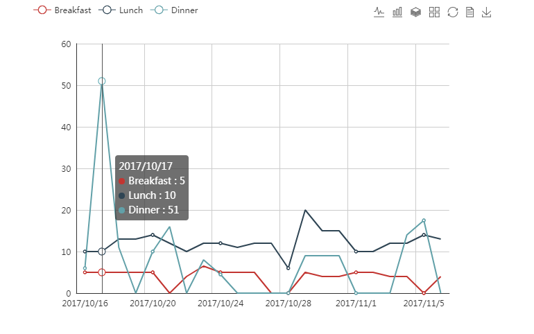
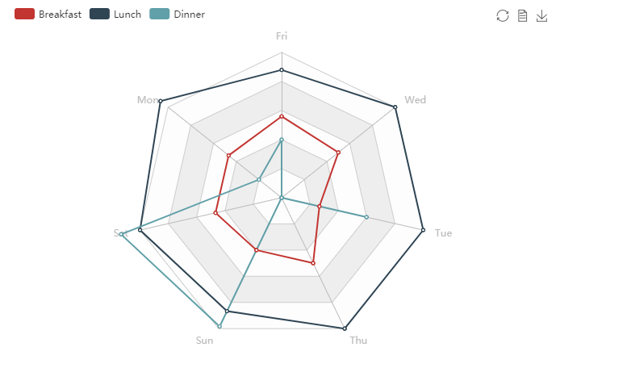

# Month-Cost
简单的记录一下我实习一个月来的花费
## 数据源
这份数据是我自己记录的自10月15日以来的生活开销，并不足一个月，并不是从我实习开始算起，所以有些花费有遗漏，比如房租，安置花费，还有我买的一些食材什么的。

```s
library(tidyverse)
library(wordcloud2)
library(recharts)
library(reshape2)
```

```s
food<-read.csv('food.csv',header=T)
cost<-read.csv("cost.csv",header = T)
```

## 每天的吃饭开销
用Echart来看看我每天简朴的饮食情况
```s
eLine(food,xvar=~Date,yvar=~Breakfast+Lunch+Dinner)
```




## 吃饭开销雷达图
用雷达图来看我每周一天三餐的消费会不会直观点，好吧其实并没有。
```s
food$week<-c('Mon','Tue','Wed','Thu','Fri','Sat','Sun','Mon','Tue','Wed','Thu','Fri','Sat','Sun','Mon','Tue','Wed','Thu','Fri','Sat','Sun','Mon')
food_long<-melt(food[,-5],value.name = "Money",variable.name = "food")
eRadar(food_long,xvar= ~week, yvar=~Money, series=~food)
```

## 数据补充说明
大家可能看到我的不少伙食开销是0，这其中发生了什么呢？
```s
food$label<-rep(1,22)#添加计数标签
sentence<-filter(food,Dinner==0)%>%group_by(event)%>%summarise(freq=sum(label))#分类汇总
wordcloud2(sentence,size=0.5)
```


图中可以看到，我靠煮汤圆和泡面蹭过了6次晚餐，留宿朋友+冲网费换来了一顿请客，有时候周末早餐没吃（睡过了），回了趟学校刷了校园卡，再就是部门组织的一次聚餐了，看了之后有没觉得我们的活动状况和账单息息相关。


## 其它生活开支
真正的大头来了，毕竟我国的恩格尔系数有那么高了，食物占不到我们开销的多大比例。
```s
wordcloud2(cost,size=1)
```


可以看到，即使没算进初期的安置费用，我的生活开销仍然是一笔不菲的数额，若大的换房两个字让我和房子中介的撕逼过程历历在目，代课说的是一笔不可描述的交易，其它的看起来仿佛也没有多少。

总的来说，我这22天花的钱如下：
### 2929.5元


以上就是我有记录的实习以来的开销了的实习过程中的开销了，非常详细，希望能对大家有所借鉴。

